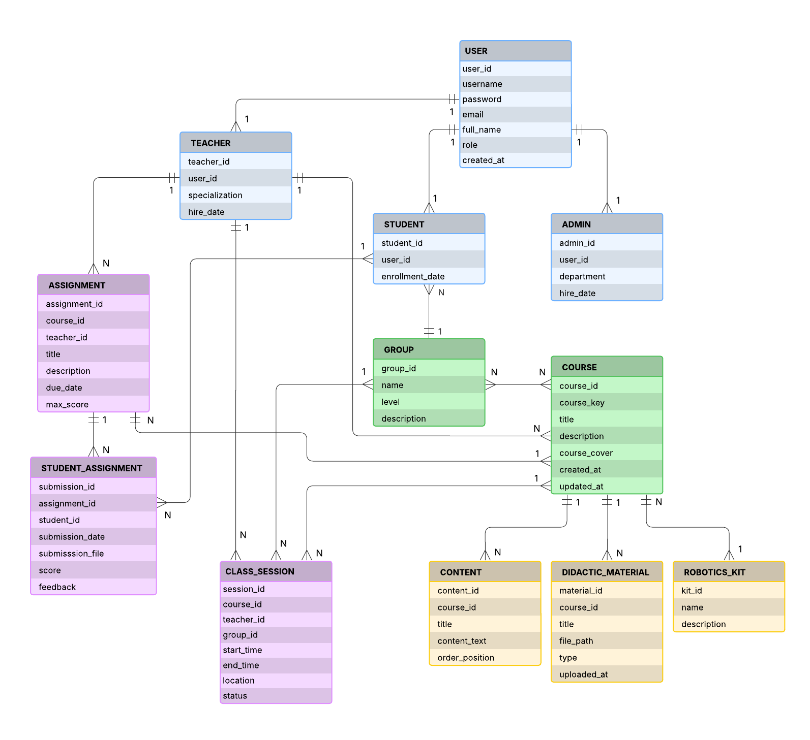

# Actividad 7 - Sistema de Gestión para Escuela de Robótica

## Descripción del Proyecto
Este sistema permite a una escuela de robótica gestionar cursos, estudiantes y profesores. La plataforma facilita a los profesores la creación y administración de contenidos educativos, mientras que los estudiantes pueden acceder a los materiales didácticos y consultar la información de los cursos asignados a sus grupos.

Características principales:
- Gestión de usuarios con roles (estudiantes, docentes, administrativos)
- Organización de estudiantes en grupos (principiante, intermedio, avanzado)
- Administración de cursos y materiales didácticos
- Asociación de kits de robótica a cada curso

## Diagrama ER
A continuación se muestra el diagrama entidad-relación que representa la estructura de la base de datos:

## Tecnologías Utilizadas
- Laravel 7
- MySQL
- Bootstrap 4
- PHP 7.4

